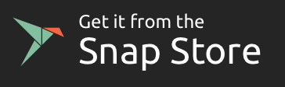

[](DuckLLM.license)
[](src/README.txt)
[](Apache-2.0.license)

# Official Downloads
<p align="left">
  &nbsp;&nbsp;
  <a href="https://play.google.com/store/apps/details?id=com.duckllm.app"></a>
   &nbsp;&nbsp;
  <a href="https://snapcraft.io/duckllm"></a>

</p>

# Official Homepage
https://eithanasulin.github.io/DuckLLM/

# Supported Systems
- Android
- Windows
- macOS
- Linux

### DuckLLM Destkop Announcement
as of today DuckLLM Desktop won't get any more updates, updates will only come from communuty contribution.

# What is DuckLLM?
DuckLLM is a free, locally-run AI designed with a strong focus on privacy and security, without compromising on performance or functionality. It simplifies the process of self-hosting an AI model on your own device - for both desktop and mobile - with a privacy-first architecture that ensures your data never leaves your machine.

# Getting Started

# Windows
1. Download [DuckLLM Installer.exe](https://github.com/EithanAsulin/DuckLLM/releases/download/Mallard/DuckLLM.Installer.exe)
2. Agree To The License And Install!

> Press `Esc` To Close It.

# Linux
1. Download [DuckLLM.deb](https://github.com/EithanAsulin/DuckLLM/releases/download/Mallard/DuckLLM.deb)
2. Open [DuckLLM.deb](https://github.com/EithanAsulin/DuckLLM/releases/download/Mallard/DuckLLM.deb) And Install!

> Press `Esc` To Close It.

# MacOS
1. Download [DuckLLM Installer.dmg](https://github.com/EithanAsulin/DuckLLM/releases/download/Mallard/DuckLLM.Installer.dmg)
2. Open [DuckLLM Installer.dmg](https://github.com/EithanAsulin/DuckLLM/releases/download/Mallard/DuckLLM.Installer.dmg)
3. Drag **DuckLLM Into The Applications Folder**

> Press `Esc` To Close It.

# Android
1. Open The Google Play Store
2. Search [DuckLLM](https://play.google.com/store/apps/details?id=com.duckllm.app) In The Search Bar
3. Install [DuckLLM](https://play.google.com/store/apps/details?id=com.duckllm.app)!

# Key Features
- **Privacy First:** Fully local execution - no data is sent to external servers.
- **Ultra Quick:** With DuckLLM's App You'll Experience Highly Impressive Speeds With Well Made Features.
- **Smooth UI:**  With **DuckLLM's Dynamic Island-like UI** You Experience High Responsiveness & Smooth Animations

# DuckLLM Mobile
> Mobile installation currently uses Wllama & Ollama for on-device inference.

1. Download DuckLLM from the Google Play Store.
2. Open the app, complete or skip the username setup, and navigate to **Download Center**.
3. Choose one of the available models:
   - **DuckLLM Light (0.6B)** - Recommended for most devices
   - **DuckLLM Base (1.6B)**
   - **DuckLLM Pro (3.1B)**


# Help & Sources 
### Requirements 
- **Hardware Requirements** Can Be Found In **[Requirements.md](https://github.com/EithanAsulin/DuckLLM/blob/master/Requirements.md).**

### Documentation
- **Documentation** Can Be Found In **[Documentation.md](https://github.com/EithanAsulin/DuckLLM/blob/master/Documentation.md).**

# Known Issues 

### MacOS (Not Fixable)
**Due To Apple's Aggressive Memory Management** on Heavy Workflows **DuckLLM** Might Be Closed By **MacOS,** To Prevent This **DuckLLM Uses a 3.1b Model Only** To Manage Memory Better.


# Commercial Use
For inquiries regarding commercial licensing, please reach out via:
- **Email**: duckinc68@gmail.com
- **Discord**: https://discord.com/invite/DkNt6FXf7J
**(This Only Applys For DuckLLM's Model The App Is Free To-Use)**

# Relationship to Qwen
DuckLLM is built on **Qwen 2.5** as its base model and extends it through fine-tuning aimed at improving performance in specific areas where the base model underperforms. Training a large language model from scratch was outside the scope of this project; the additional training is focused on targeted improvements rather than architectural changes.

# Source Code
To Get DuckLLM's Source Code You Can Run 
```bash
git clone https://github.com/EithanAsulin/DuckLLM.git
```

# Contributors
- **[psale](https://github.com/psale)**

# License
- **DuckLLM Proprietary License**: Covers the DuckLLM model weights. Free for personal use; a commercial license is required for business use.
- **Apache 2.0**: Covers the Qwen 2.5 base model.
